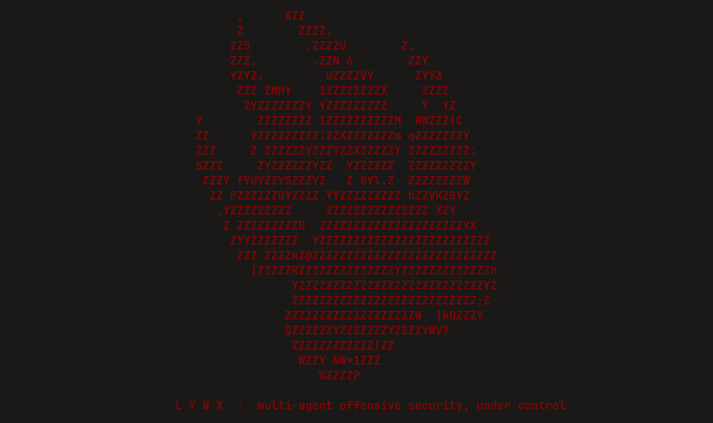

<p align="center">
  
</p>

<h1 align="center">Lynx</h1>

<p align="center">
  <em>Multi-agent offensive security, under control.</em>
</p>

<p align="center">
  <a href="#requirements"></a>
  
  
  <a href="./LICENSE"></a>
</p>

> A multi-agent **cybersecurity / pentesting** framework that runs on top of
> [opencode](https://opencode.ai) inside a hardened, host-networked Docker
> sandbox. Its multi-agent architecture is inspired 1:1 by
> [CAI (Cybersecurity AI)](https://github.com/aliasrobotics/cai) — re-implemented
> from scratch in **TypeScript**, with a consistent **Human-In-The-Loop (HITL)**
> policy.

> [!WARNING]
> Offensive-security tool. Use **only** against systems you own or are explicitly
> authorized to test. Read [`DISCLAIMER`](./DISCLAIMER) before use.

---

## Why this design

opencode already provides what is genuinely hard to build well: a polished
terminal/UI experience, model & provider management, agent/subagent execution,
tool calling, bash integration and a permission system. Lynx does **not**
reinvent any of that. Instead it treats opencode as the **runtime and interface**
and layers the CAI-style multi-agent _architecture_ on top:

| CAI (Python)                                               | Lynx (TypeScript on opencode)                                                |
| ---------------------------------------------------------- | -------------------------------------------------------------------------------- |
| `Agent` personas (red team, recon, …)                      | opencode **agents** (`runtime/agent/*.md`)                                       |
| `handoff` / `transfer_to_X`                                | opencode **`task`** tool (orchestrator → subagent)                               |
| Orchestration patterns (swarm / parallel / sequential)     | **orchestrator agent** + the **lynx plugin**                                 |
| Per-category tools (recon, exploitation, web, …)           | custom **tools** in the lynx plugin                                          |
| Human-In-The-Loop                                          | central **HITL policy** in the plugin (`permission.ask` + `tool.execute.before`) |
| Containerized virtualization (`--network host`, `NET_RAW`) | the **Docker sandbox** (`docker/`)                                               |

See [`docs/architecture.md`](./docs/architecture.md) for the full mapping.

## How it works

```
 host ──► lynx (launcher CLI)
            │  1. checks Docker is installed
            │  2. builds the sandbox image if missing (Kali + tools + opencode + lynx, baked in)
            │  3. starts the container:  --network host  --cap-add NET_ADMIN,NET_RAW  seccomp=unconfined
            │  4. mounts host opencode auth (read-only) + your engagement workspace
            ▼
 sandbox container ──► opencode TUI
            │   loads lynx global config (~/.config/opencode):
            │     • opencode.json   — providers, agents, permissions, plugin
            │     • plugin/         — HITL policy, sandbox guard, pentest tools
            │     • agent/          — orchestrator + recon + web-exploit + reporter
            ▼
        you ⇄ orchestrator ⇄ specialist subagents ⇄ tools  (every dangerous step gated by HITL)
```

opencode for Lynx is **only ever launched inside the sandbox**. The plugin
additionally refuses to arm its offensive tooling unless it detects the sandbox
marker (defense in depth — see [`docs/sandbox.md`](./docs/sandbox.md)).

## Requirements

- **Docker** (required — the launcher refuses to run without it)
- **Node.js ≥ 20** (to run the host launcher)
- A model provider configured in opencode on your host (e.g. `opencode auth login`)

## Quick start

```bash
# 1. Build the launcher
npm install
npm run build

# 2. Launch — builds the sandbox image on first run, then drops you into opencode
node dist/launcher/index.js
#   (or `npm link` once, then just: lynx)
```

On first launch the framework starts in **strict HITL** mode: every potentially
intrusive action pauses for your approval.

## Project status

Early development.

- **v1 (vertical slice):** full pipeline end-to-end (sandbox → opencode → plugin
  → agents → HITL → tools) with four agents: `orchestrator`, `recon`,
  `web-exploit`, `reporter`, plus per-agent model selection.
- **Phase 2 (essential patterns):** the orchestration **pattern engine** —
  `lynx_parallel`, `lynx_pipeline`, `lynx_swarm` — driving agents via
  the opencode SDK (orchestrator-only; HITL still applies).

Remaining CAI specialist agents, the `conditional`/`hierarchical` patterns and a
declarative `lynx.yml` are added incrementally
(see [`docs/architecture.md`](./docs/architecture.md) → _Roadmap_).

> After changing the plugin or agents, rebuild the sandbox image so the baked
> config updates: `lynx build`.

## Repository layout

```
lynx/
├── src/launcher/          # host-side CLI (TypeScript) — the `lynx` command
├── runtime/               # baked into the sandbox image as opencode global config
│   ├── opencode.json      #   providers, agents, permissions, plugin registration
│   ├── plugin/            #   the lynx plugin: HITL, sandbox guard, tools
│   ├── agent/             #   agent personas (markdown)
│   └── workspace-skeleton # ready-made engagement folder structure
├── docker/                # Dockerfile + entrypoint + compose for the sandbox
└── docs/                  # architecture, HITL, sandbox & agent documentation
```

## License & credits

[MIT](./LICENSE). Inspired by CAI's architecture; contains **no** CAI source
code. See [`NOTICE`](./NOTICE) and [`CREDITS.md`](./CREDITS.md) for full
attribution (CAI, the OpenAI Agents SDK, opencode, and the bundled tools).
